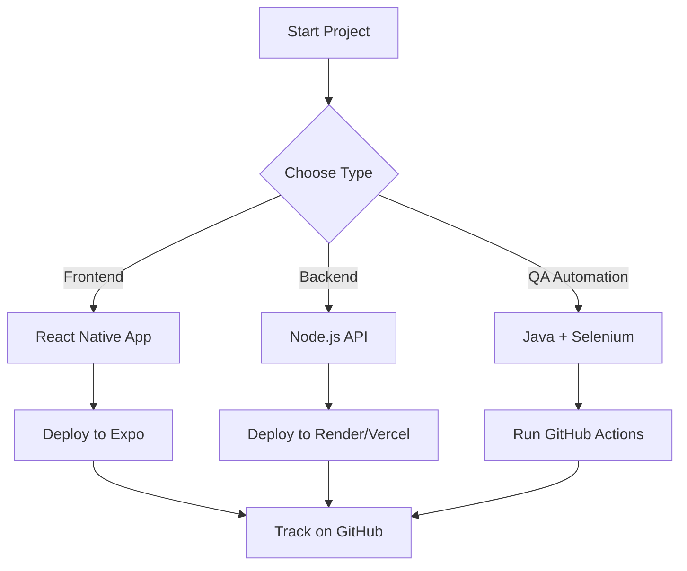

# 👋 Hi, I'm Grish Joshi

Welcome to my GitHub profile! I'm a passionate **full-stack developer** and **QA automation engineer** from Nepal 🇳🇵. I love solving problems by building hands-on projects and visual dashboards. Whether it’s an automation script or a mobile app, I enjoy turning ideas into working solutions.

---

## 🧩 Mermaid Diagram (Auto-rendered)



---

## 📈 Automation Chart (Auto-updated with GitHub Actions)

> Example chart for test distribution (generated via Python + Matplotlib):


*🛠️ This chart auto-updates using GitHub Actions. New charts are added as I progress in QA automation and analytics.*

---

## 💼 Projects I'm Building

- 📱 **Testbook-style Quiz App** (React Native + PostgreSQL)
- 🏦 **Mobile Banking Clone** (Expo + Node.js + Prisma)
- 💰 **Expense Tracker App** (Charts + Categories + Monthly Views)
- 🧪 **30 Days of Java Automation** (Selenium, TestNG, Maven)

---

## 🔧 Tech Stack

```text
📱 Frontend:   React Native, JavaScript, Tailwind CSS
⚙️ Backend:    Node.js, Express.js, JWT Auth
🧠 Database:   PostgreSQL, Prisma ORM, SQL
🧪 QA:         Java, Selenium, TestNG, Maven
🚀 DevOps:     GitHub Actions, VS Code, Git, Expo
```

---

## 📊 What's Next?

- 🔄 Automating report updates with daily GitHub Actions
- 📂 Generating code coverage and bug reports
- 📈 Visualizing expense and booking analytics
- 🌐 Deploying full-stack apps using CI/CD

---

## 📫 Connect with Me

- 💻 GitHub: [github.com/grishj](https://github.com/grishj)
- ✉️ Email: grish9869404451@gmail.com

---

_💡 “I build, test, learn — and repeat until it works.”_
